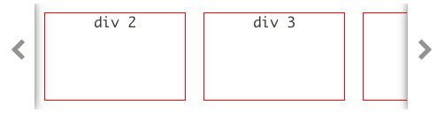

# Welcome To OA's scrollSliderView!
這是一個 based on [jQuery](http://jquery.com/) 的前端 library。

---
## 聲明
本作品只限分享於研究、研討性質之使用，並不提供任何有營利效益之使用。  
如有營利用途，務必告知作者 [OA](http://www.ioa.tw/) (<comdan66@gmail.com>)，並且經由作者同意。


<br/>
## 簡介
* 這是一個前端 jQuery extend function，主要架構於 [jQuery](http://jquery.com/)。  

* Demo 範例頁面: [http://comdan66.github.io/OA-scrollSliderView/](http://comdan66.github.io/OA-scrollSliderView/)

* 此版本是支援 **responsive** 的頁面。


<br/>
## 目錄
* [說明](#說明)
	* [加入 jquery.js](#加入 jquery.js)
	* [加入 oa-scrollSliderView 的 css、js](#加入 oa-scrollSliderView 的 css、js)
	* [Html sample](#Html sample)
	* [Javascript sample](#Javascript sample)
	* [效果](#效果)
* [Options](#Options)
	* [selector](#selector)
	* [maxCount](#maxCount)
	* [sildersWidth](#sildersWidth)
	* [arrow](#arrow)
	* [silder](#silder)
* [Data attr](#Data attr)
	* [Option、data 對應](#Option、data 對應)
	* [Ex: data-silder_width](#data-silder_width)
* [關於](#關於)


<br/>
## <a name="說明"></a>說明
* <a name="加入 jquery.js"></a>加入 jquery.js

	```html
	  <script src="jquery-1.10.2.min.js" language="javascript" type="text/javascript" /></script>
```

* <a name="加入 oa-scrollSliderView 的 css、js"></a>加入 oa-scrollSliderView 的 css、js

	```html
	  <link href="oa-scrollSliderView.css" rel="stylesheet" type="text/css">
	  <script src="oa-scrollSliderView.js" language="javascript" type="text/javascript" /></script>
```

* <a name="Html sample"></a>Html sample

	```html
	  <div class='silders'>
	  <div class='silder'></div>
	  <div class='silder'></div>
	  <div class='silder'></div>
	  <div class='silder'></div>
	  <div class='silder'></div>
	  <div class='silder'></div>
	  <div class='silder'></div>
	  <div class='silder'></div>
	</div>
```

* <a name="Javascript sample"></a>Javascript sample

	```javascript
	  $('.silders').OAscrollSliderView ();
```

* <a name="效果"></a>效果


<br/>
## <a name="Options"></a>Options
* <a name="selector"></a>selector  
	指定子元素的 selector 條件，預設值 .silder

	```html
	  <div class='silders'>
	    <div class='my_silder'>div 1</div>
	    <div class='my_silder'>div 2</div>
	    <div class='my_silder'>div 3</div>
	    <div class='my_silder'>div 4</div>
	    <div class='my_silder'>div 5</div>
	  </div>
```

	```javascript
	    $('.silders').OAscrollSliderView ({
	      selector: '.my_silder'
 	    });
```
	

* <a name="maxCount"></a>maxCount  
	設定最大數量，當為 0 時，則不設定，預設值 0

	```html
	  <div class='silders'>
	    <div class='silder'>div 1</div>
	    <div class='silder'>div 2</div>
	    <div class='silder'>div 3</div>
	    <div class='silder'>div 4</div>
	    <div class='silder'>div 5</div>
	  </div>
```

	```javascript
	  $('.silders').OAscrollSliderView ({
	    maxCount: 3
	  });
```
	

* <a name="sildersWidth"></a>sildersWidth  
	整體 silders 的總寬度(包含箭頭)，預設值 100%

	```html
	  <div class='silders'>
	    <div class='silder'>div 1</div>
	    <div class='silder'>div 2</div>
	    <div class='silder'>div 3</div>
	    <div class='silder'>div 4</div>
	    <div class='silder'>div 5</div>
	  </div>
```

	```javascript
	  $('.silders').OAscrollSliderView ({
	    sildersWidth: '500px'
	  });
```
	

* <a name="arrow"></a>arrow  
	箭頭物件的設定，其中包含了:  
	- width，寬度，預設值 40px  
	- leftSvg，左邊 svg 圖示  
	- rightSvg，右邊 svg 圖示

	```html
	  <div class='silders'>
	    <div class='silder'>div 1</div>
	    <div class='silder'>div 2</div>
	    <div class='silder'>div 3</div>
	    <div class='silder'>div 4</div>
	    <div class='silder'>div 5</div>
	  </div>
```

	```javascript
	  $('.silders').OAscrollSliderView ({
	    arrow: {
	      width: '70px',
	      leftSvg: '<svg version="1.1" xmln...', // svg tag file
	      rightSvg: '<svg version="1.1" xmln...' // svg tag file
	    }
	  });
```
	

* <a name="silder"></a>silder  
	單一子元素的設定，其中包含了:  
	- width，寬度，預設值 160px  
	- height，高度，預設值 100px  
	- marginTop，上方 margin 值，預設值 10px  
	- marginBottom，下邊 margin 值，預設值 10px  
	- marginLeft，左邊 margin 值，預設值 10px  
	- marginRight，右邊 margin 值，預設值 20px
	
	```html
	  <div class='silders'>
	    <div class='silder'>div 1</div>
	    <div class='silder'>div 2</div>
	    <div class='silder'>div 3</div>
	    <div class='silder'>div 4</div>
	    <div class='silder'>div 5</div>
	    <div class='silder'>div 6</div>
	    <div class='silder'>div 7</div>
	    <div class='silder'>div 8</div>
	    <div class='silder'>div 9</div>
	  </div>
```

	```javascript
	  $('.silders').OAscrollSliderView ({
	  	  silder: {
	  	    width: '100px',
	  	    height: '50px',
	  	    marginTop: '25px',
	  	    marginBottom: '0',
	  	    marginRight: '30px',
	  	    marginLeft: '20px'
	  	  }
	  	});
```
	

<br/>
## <a name="Data attr"></a>Data attr
* <a name="Option、data 對應"></a>Option、data 對應

	```
	* selector       - data-selector
 	* maxCount       - data-maxCount
	* sildersWidth   - data-sildersWidth
	* arrow
		* width        - data-arrow_width
		* leftSvg      - data-arrow_leftSvg
		* rightSvg     - data-arrow_rightSvg
	* silder
		* width        - data-silder_width
		* height       - data-silder_height
		* marginTop    - data-silder_marginTop
		* marginBottom - data-silder_marginBottom
		* marginRight  - data-silder_marginRight
		* marginLeft   - data-silder_marginLeft
```
* <a name="data-silder_width"></a>Ex: data-silder_width  
	使用 thml tag data attribute 設定，其設定值權限最大

	```html
  <div class='silders' data-silder_width='100px'>
    <div class='silder'>div 1</div>
    <div class='silder'>div 2</div>
    <div class='silder'>div 3</div>
    <div class='silder'>div 4</div>
    <div class='silder'>div 5</div>
    <div class='silder'>div 6</div>
    <div class='silder'>div 7</div>
  </div>
```

	```javascript
	  $('.silders').OAscrollSliderView ();
```
	

<br/>
## <a name="關於"></a>關於
* 作者名稱 - [OA Wu](http://www.ioa.tw/)

* E-mail - <comdan66@gmail.com>

* 作品名稱 - OAScrollSliderView

* 最新版本 - 1.0.0

* GitHub - [OA-scrollSliderView](https://github.com/comdan66/OA-scrollSliderView)

* 更新日期 - 2014/12/02